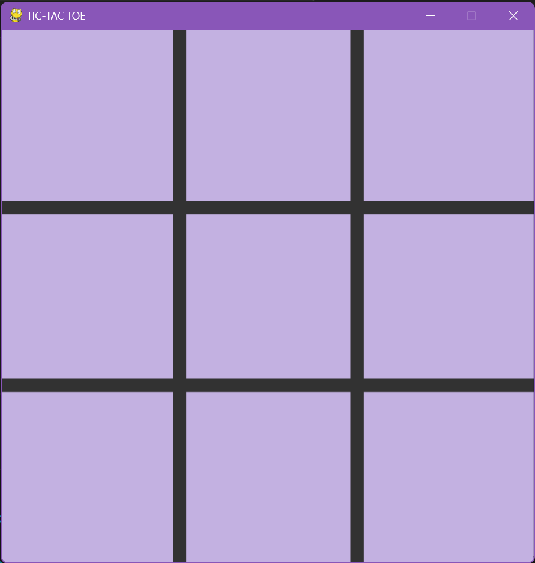
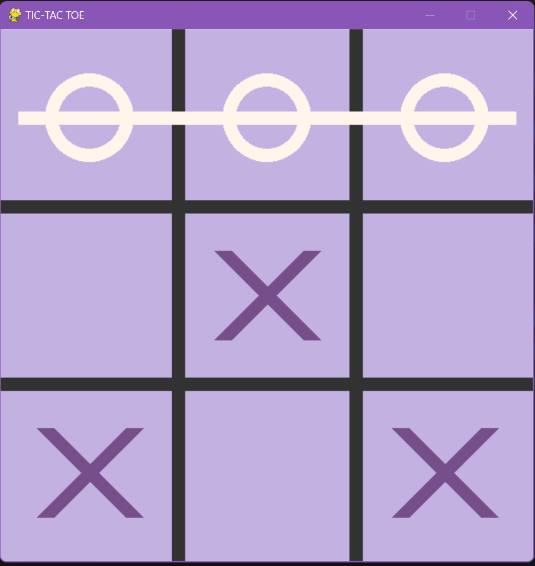
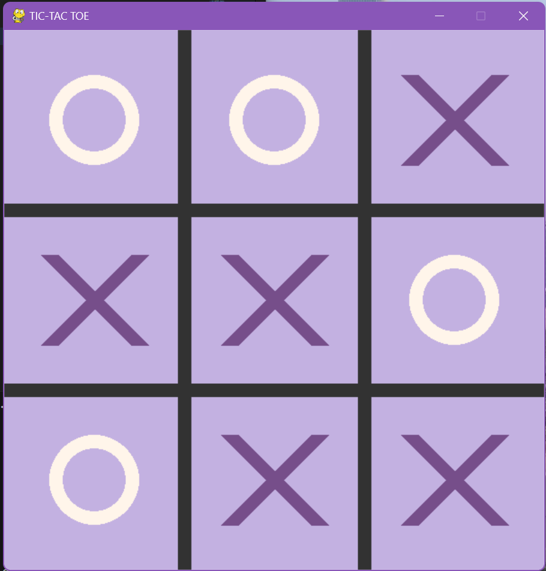

# Unbeatable Tic-Tac-Toe AI Agent

This project features an AI agent that plays the classic game of Tic-Tac-Toe against a human player, utilising advanced algorithms such as Minimax with Alpha-Beta Pruning to guarantee an unbeatable experience.

## Project Overview
The AI agent in this project is designed to provide an unbeatable challenge to human players in the classic game of Tic-Tac-Toe. By implementing the Minimax algorithm with Alpha-Beta Pruning, the AI evaluates and selects optimal moves to ensure victory or a draw in every game.

## Features
- Unbeatable AI: The AI agent is programmed to make optimal moves using the Minimax algorithm with Alpha-Beta Pruning, guaranteeing a challenging and unbeatable experience for human players.
- Interactive Gameplay: Players can engage with the AI agent in a traditional Tic-Tac-Toe game interface, experiencing the thrill of playing against a formidable opponent.

## Technologies Used
- Python: The AI agent's logic and game implementation are written in Python.
- Pygame: The graphical user interface for the Tic-Tac-Toe game is designed using the library to enhance user experience.
- Minimax Algorithm: The AI uses the Minimax algorithm to make strategic decisions.
- Alpha-Beta Pruning: The AI enhances its decision-making process using the Alpha-Beta Pruning optimisation technique.

## Installation
To run the Tic-Tac-Toe game with the AI agent, ensure you have Python and Pygame installed on your system. You can install Pygame using the following command:

``` pip install pygame ```

## Usage
Run the Python script to start the unbeatable Tic-Tac-Toe AI game. Follow the game instructions to change game modes and experience the thrill of a challenging game.

## Game Instructions
- press 'g' to change game mode (ai or pvp)
- press '0' to change ai level to 0 (random)
- press '1' to change ai level to 1 (impossible)
- press 'r' to restart the game

## Game Snapshots

- ### Snapshot 1 - Start


- ### Snapshot 2 - Circle Win


- ### Snapshot 3 - Cross Win


- ### Snapshot 4 - Draw/Tie


## Customisation
The AI agent's difficulty level and gameplay experience can be customised by adjusting the depth of the Minimax algorithm and fine-tuning the Alpha-Beta Pruning parameters.

## Support and Contribution
If you encounter any issues with the AI agent or have ideas for improvement, please open an issue in the repository. Contributions are welcome through pull requests.

## License
This project is licensed under the MIT License • LICENSE.

Challenge yourself against the unbeatable Tic-Tac-Toe AI agent and experience the thrill of strategic gameplay!